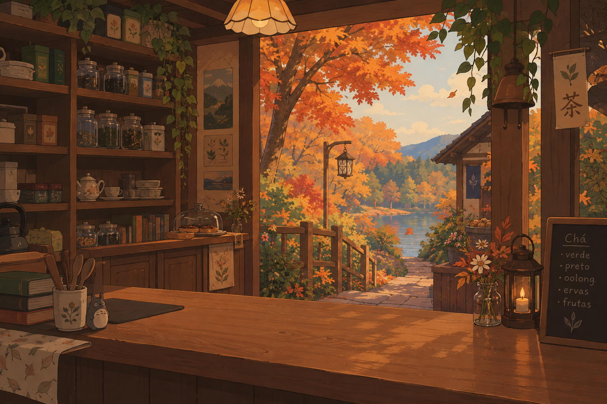
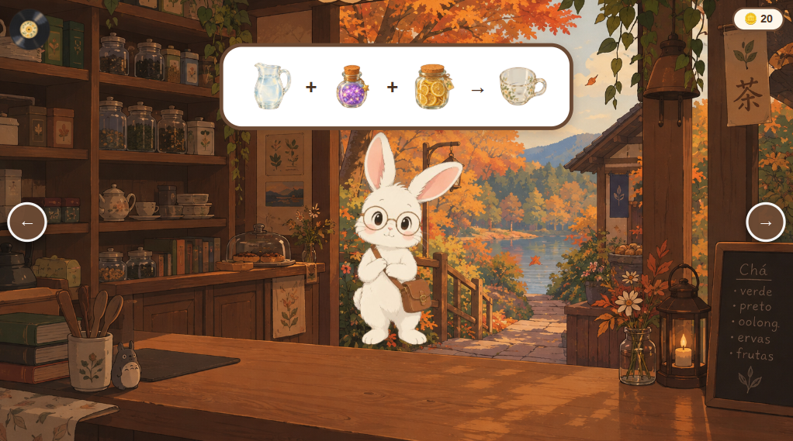
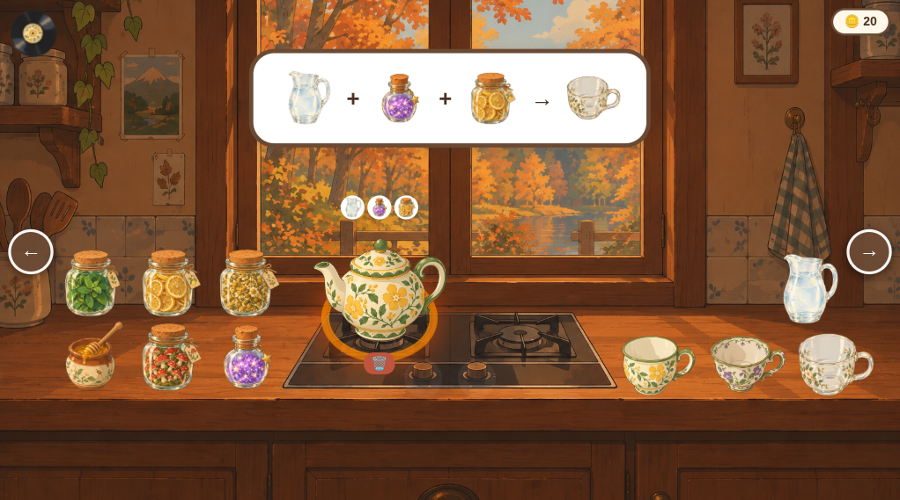

# 🍵 Tea Heaven 

Welcome to **Tea Heaven**! This is a cozy management game (Studio Ghibli style) where you brew magical and delicious teas for cute customers. 

> **⚠️ Note:** This is a **First Release / Demo**. The game is currently in development!

## 🍂 About the Game
The main idea is to create a relaxing environment. You serve customers at the counter, go to the kitchen, pick the right cup, mix water with two magical ingredients, and boil it on the stove to deliver the perfect drink. All of this is accompanied by a pleasant ambient soundtrack!

### Game Previews
| The Shop | The Kitchen |
| :---: | :---: |
|  |  |

## 📖 Recipe Book
The game currently features **9 strict recipes**. To get the order right, you need the exact combination of Cup + Water + 2 Ingredients.

- **Bear Hug Tea:** Water + Lemon + Honey
- **Aurora Borealis Tea:** Water + Chamomile + Mint
- **Sunbeam Tea:** Water + Magic Dust + Mushrooms
- **Stellar Tea:** Water + Lemon + Magic Dust
- **Sweet Dreams Tea:** Water + Chamomile + Honey
- **Good Witch Tea:** Water + Mint + Mushrooms
- **Gentle Breeze Tea:** Water + Lemon + Mint
- **Autumn Afternoon Tea:** Water + Chamomile + Mushrooms
- **Forest Tea:** Water + Magic Dust + Honey

## 🛠️ Technologies
The game was built 100% Client-side using fundamental web technologies, without any heavy frameworks:
- **HTML5** (Structure)
- **Vanilla CSS3** (Responsive styling, keyframe animations, and layout)
- **Vanilla JavaScript** (Drag & drop logic, state management, and audio integration)

## 🚀 How to Play

**Play Online:**
1. Access the live game link on **GitHub Pages** (https://isabela-cp.github.io/TeaHeaven/).

**Run Locally:**
1. Clone this repository to your machine.
2. Open the `index.html` file in any modern web browser.

**Gameplay Steps:**
1. Turn on the record player on the counter to start the music.
2. Check the customer's order in their thought bubble (Frog, Bunny, or Bear).
3. Click the arrow to go to the kitchen.
4. Drag Water + 2 ingredients into the teapot and place it on the stove.
5. Click the black button on the stove to light the fire and wait 3 seconds.
6. Pour the ready tea into the correct cup.
7. Click the full cup to hold it, go back to the shop, and click the customer to deliver it!
